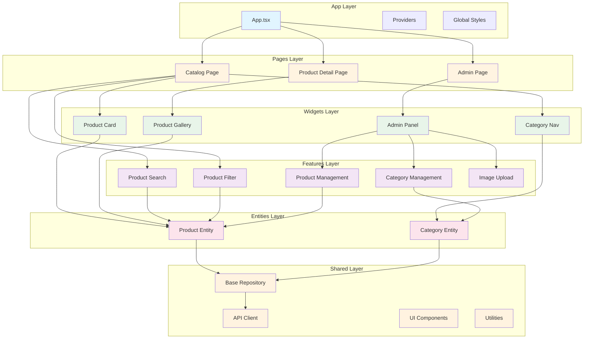
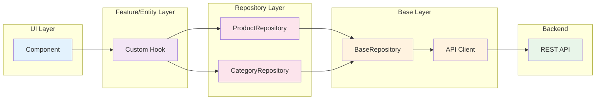
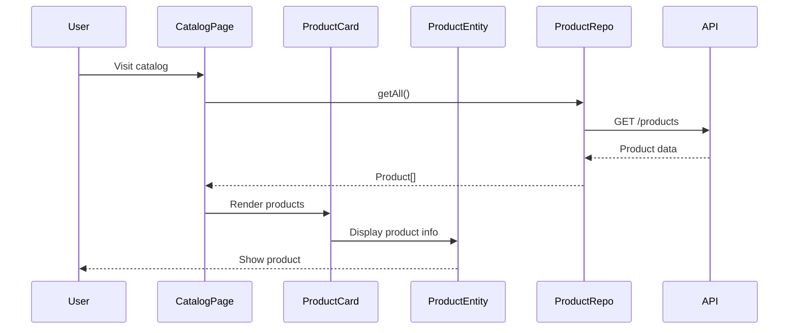
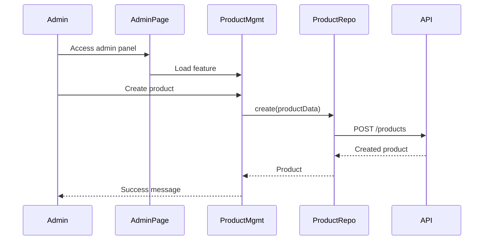

# FSD Architecture Diagram

```mermaid
graph TD
    subgraph "App Layer"
        APP[App.tsx]
        PROVIDERS[Providers]
        STYLES[Global Styles]
    end
    
    subgraph "Pages Layer"
        CATALOG[Catalog Page]
        DETAIL[Product Detail Page]
        ADMIN[Admin Page]
    end
    
    subgraph "Widgets Layer"
        CARD[Product Card]
        GALLERY[Product Gallery]
        NAV[Category Nav]
        PANEL[Admin Panel]
    end
    
    subgraph "Features Layer"
        SEARCH[Product Search]
        FILTER[Product Filter]
        PMGMT[Product Management]
        CMGMT[Category Management]
        UPLOAD[Image Upload]
    end
    
    subgraph "Entities Layer"
        PRODUCT[Product Entity]
        CATEGORY[Category Entity]
    end
    
    subgraph "Shared Layer"
        API[API Client]
        REPO[Base Repository]
        UI[UI Components]
        LIB[Utilities]
    end
    
    APP --> CATALOG
    APP --> DETAIL
    APP --> ADMIN
    
    CATALOG --> CARD
    CATALOG --> NAV
    CATALOG --> SEARCH
    CATALOG --> FILTER
    
    DETAIL --> GALLERY
    
    ADMIN --> PANEL
    PANEL --> PMGMT
    PANEL --> CMGMT
    PANEL --> UPLOAD
    
    CARD --> PRODUCT
    GALLERY --> PRODUCT
    NAV --> CATEGORY
    
    SEARCH --> PRODUCT
    FILTER --> PRODUCT
    PMGMT --> PRODUCT
    CMGMT --> CATEGORY
    
    PRODUCT --> REPO
    CATEGORY --> REPO
    
    REPO --> API
    
    style APP fill:#e1f5ff
    style CATALOG fill:#fff4e1
    style DETAIL fill:#fff4e1
    style ADMIN fill:#fff4e1
    style CARD fill:#e8f5e9
    style GALLERY fill:#e8f5e9
    style NAV fill:#e8f5e9
    style PANEL fill:#e8f5e9
    style SEARCH fill:#f3e5f5
    style FILTER fill:#f3e5f5
    style PMGMT fill:#f3e5f5
    style CMGMT fill:#f3e5f5
    style UPLOAD fill:#f3e5f5
    style PRODUCT fill:#fce4ec
    style CATEGORY fill:#fce4ec
    style API fill:#fff3e0
    style REPO fill:#fff3e0
    style UI fill:#fff3e0
    style LIB fill:#fff3e0
```

## Repository Pattern Flow

```mermaid
graph LR
    subgraph "UI Layer"
        COMP[Component]
    end
    
    subgraph "Feature/Entity Layer"
        HOOK[Custom Hook]
    end
    
    subgraph "Repository Layer"
        PREPO[ProductRepository]
        CREPO[CategoryRepository]
    end
    
    subgraph "Base Layer"
        BASE[BaseRepository]
        CLIENT[API Client]
    end
    
    subgraph "Backend"
        API[REST API]
    end
    
    COMP --> HOOK
    HOOK --> PREPO
    HOOK --> CREPO
    PREPO --> BASE
    CREPO --> BASE
    BASE --> CLIENT
    CLIENT --> API
    
    style COMP fill:#e3f2fd
    style HOOK fill:#f3e5f5
    style PREPO fill:#fce4ec
    style CREPO fill:#fce4ec
    style BASE fill:#fff3e0
    style CLIENT fill:#fff3e0
    style API fill:#e8f5e9
```

## Data Flow: Public User

```mermaid
sequenceDiagram
    participant User
    participant CatalogPage
    participant ProductCard
    participant ProductEntity
    participant ProductRepo
    participant API
    
    User->>CatalogPage: Visit catalog
    CatalogPage->>ProductRepo: getAll()
    ProductRepo->>API: GET /products
    API-->>ProductRepo: Product data
    ProductRepo-->>CatalogPage: Product[]
    CatalogPage->>ProductCard: Render products
    ProductCard->>ProductEntity: Display product info
    ProductEntity-->>User: Show product
```

## Data Flow: Admin User

```mermaid
sequenceDiagram
    participant Admin
    participant AdminPage
    participant ProductMgmt
    participant ProductRepo
    participant API
    
    Admin->>AdminPage: Access admin panel
    AdminPage->>ProductMgmt: Load feature
    Admin->>ProductMgmt: Create product
    ProductMgmt->>ProductRepo: create(productData)
    ProductRepo->>API: POST /products
    API-->>ProductRepo: Created product
    ProductRepo-->>ProductMgmt: Product
    ProductMgmt-->>Admin: Success message
```
